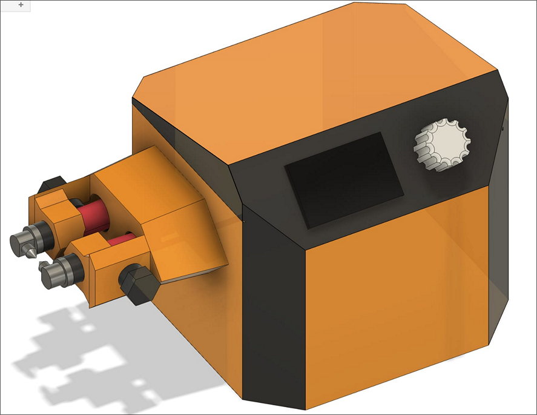

# Spotwelder 
design progress of a MOT based spot welder 

## Feautres / Roadmap 

- [] precise digital control
- [] casing / enclosure 
- [] manual mode 
- [] cheap / easy to make as posible 

## Notes 

teoretical circuit is up, some simulation regarding the zero cross voltage detector have been done in circuit simulato Qucs-s
, power control baord needs X class capacitors to be safer, case is going to be hard since Mot transformer is really heavy. 

### some design concepts (Not final Product)

